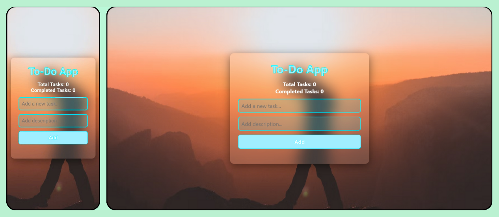

# ✅ To-Do List Web App

A modern, fully responsive and interactive To-Do List web app built using **HTML, CSS, and JavaScript**. It features a transparent blurred UI, animated icons, task counters, and full CRUD functionality.



## 🚀 Features

- ✅ Add, edit, delete, and mark tasks as completed
- 🎯 Real-time task counter (Total & Completed tasks)
- ✨ Interactive UI with blur background and vibrant colors
- 📱 Fully responsive design for all screen sizes
- 🔁 State updates instantly without reloading
- 🎨 Icons for complete (`✔️`), edit (`✏️`), and delete (`🗑️`) actions

## 🔧 Technologies Used

- HTML5
- CSS3 (with glassmorphism design)
- JavaScript (DOM manipulation)
- Font Awesome Icons

## 📁 Folder Structure

```plaintext
📦 todo-app/
├── 📄 index.html
├── 📄 style.css
├── 📄 script.js
├── 🖼️ background-image.avif
├── 🖼️ screenshot.png
└── 📄 README.md
```

## 📸 Preview

You can open the `index.html` file directly in your browser.

## 🛠️ How to Use

1. **Clone the repository**
   ```bash
   git clone https://github.com/Karan-CS298/todo-app.git

2. **Navigate into the project folder**
   ```bash
   cd todo-app

3. Open index.html in your browser

## 💬 Contact
- **Name**: Karan Singh
- **Email**: 8094karansingh@gmail.com
- **Github**: [github.com/Karan-CS298](https://github.com/Karan-CS298)
- **LinkedIn**: [linkedin.com/in/karan-singh-cs298](https://linkedin.com/in/karan-singh-cs298)

